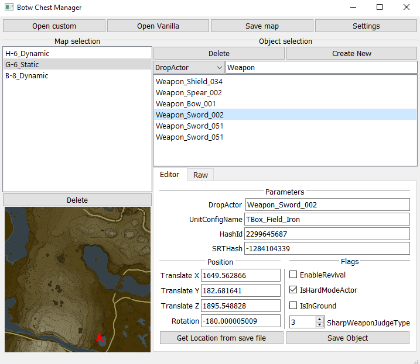
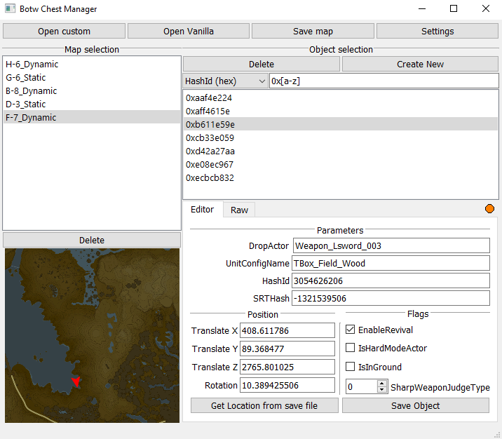

# Botw Chest Manager

Botw chest manager is a small gui tool allowing to easily manage chests. Sometimes, Ice Spear can be very time consuming when all you want to do is add a new chest, or edit the content of an existing chest.

## How it works

The creation of new chests relies on the fact that the player's location is saved every time a save is made.
By going to the place where you want to add a new chest, and by performing a manual save, you can add a chest using the tool.

The tool can automatically extract the coordinates from a save file, thanks to botw-save-editor package. for security reasons, only the last save will be read by the app.

**If you want to use this tool, I strongly encourage you to take a look at this tutorial on how to install and use Botw Chest Manager.**

## Limitations

For now, the tool has some limitations:
- It can only manage overworld chests
- DLC is required in order to load the vanilla map

## Setup

- Run `pip install -r requirements.txt` at the tool location
  - This will download the following packages: `oead`, `pyqt5`, `botw-save-editor`
- Open the tool with `python3 main.py`
- Set your paths in the Settings before trying to load any map. It will fail if it has no paths.
  - the paths needed are the DLC folder and the save folder
- Restart the tool in order to apply newly settings

## Known issues

- If an object is outside of the area it should belong to, the chest preview on the app map will likely be inverted.

Keep in mind that this is only the beta version, and therefore bugs can occur! Any feedback is greatly appreciated!
